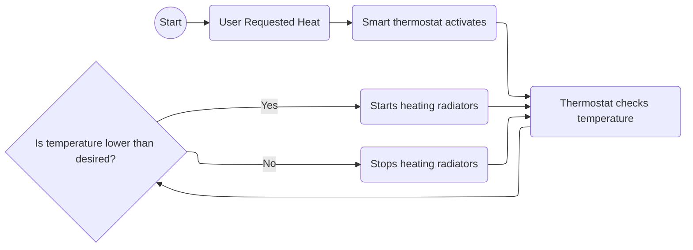
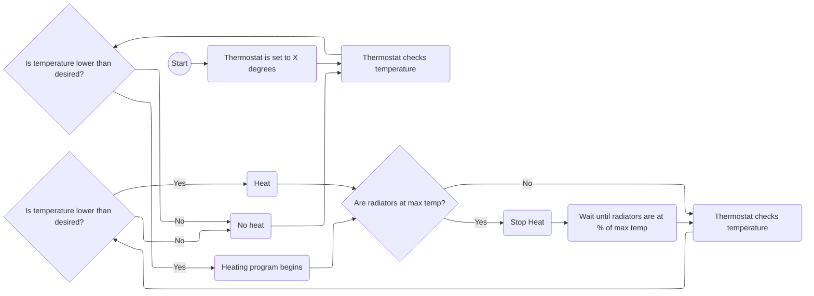

# Smart Thermostat design

## Problem statement

Currently old thermostats are "dumb" and only work with the current data they have. 
I would like to have a way to control my thermostat remotely and for it to learn based on my usage data how and when to start heating/cooling my home.

The smart thermostat should come as an enhancement to old school thermostats without the need to buy new equipment.

## Requirements

### Control remotely

Thermostat should be able to be controlled remotely by users that are authorized to access the home network. 
Use cases:
1. While I am at work I don't want the home to be heated for no reason. I want to start heating my home x hours before coming home.
2. I am on a long vacation, away from home, and I am not sure if I turned off the heating before leaving. Using the smart thermostat I want to be able to check on the heating status and turn off the heating.
3. I am going to be away from home for 1 week, I want to be able to schedule the thermostat to start heating the home 1 day before I arrive home.

### Usage pattern learning

Thermostat should be able to:
- learn from my behavior when I want to start heating/cooling the home
- what is the best temperature for my household
- autonomously start heating/cooling the home
    - if autonomous control is not desired, it should make suggestions about heating/cooling
- leverage the alarm clock to determine when my day starts and temperature should rise after sleeping
    - it should also leverage my usual sleeping hours to lower the temperature in the house

### Stats reviewing

I want to see when the heating/cooling starts in my home so that I can see usage patterns, when heating becomes inefficient.
I also want to be able to see how heating/cooling changes based on the wheatear outside to identify inefficiencies in my home insulation. 

### Smart heating unit control

Some old thermostats blindly tell the heating unit to keep pumping heat even though the radiators are at their maximum heat output.
It should go through phases of on and off so that heating efficiency is maximized.

## Flow diagrams

### Control remotely

### Smart heating unit control

